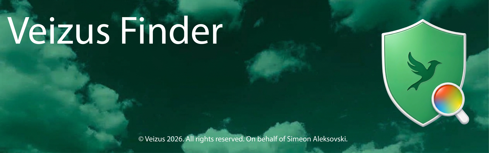
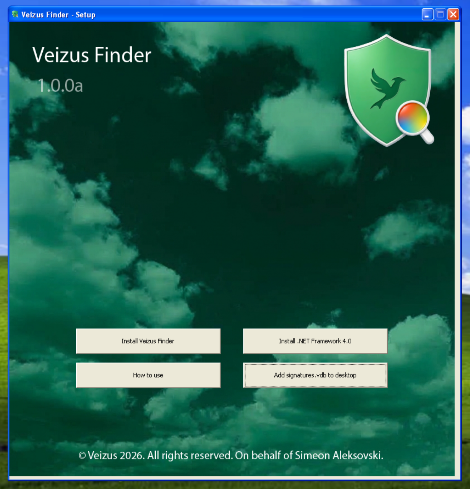
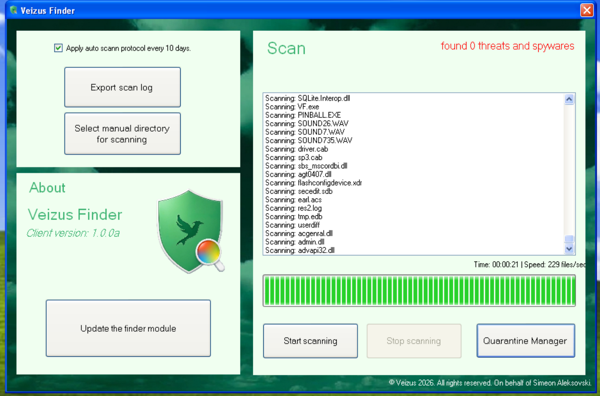
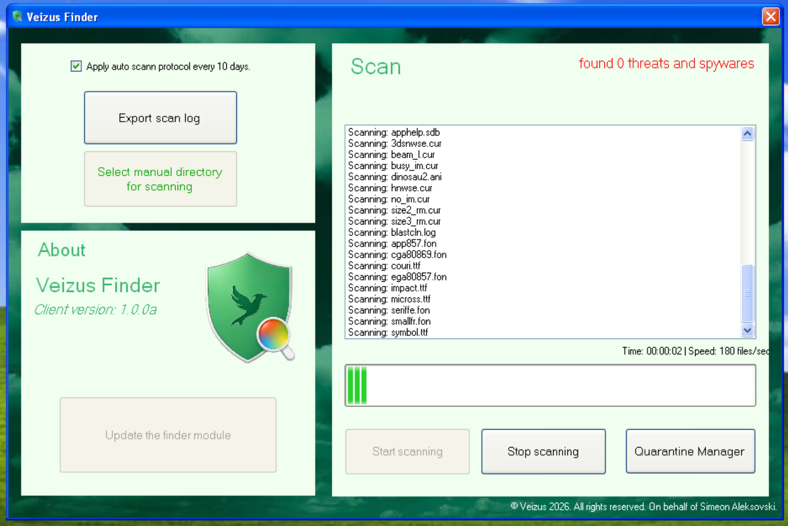
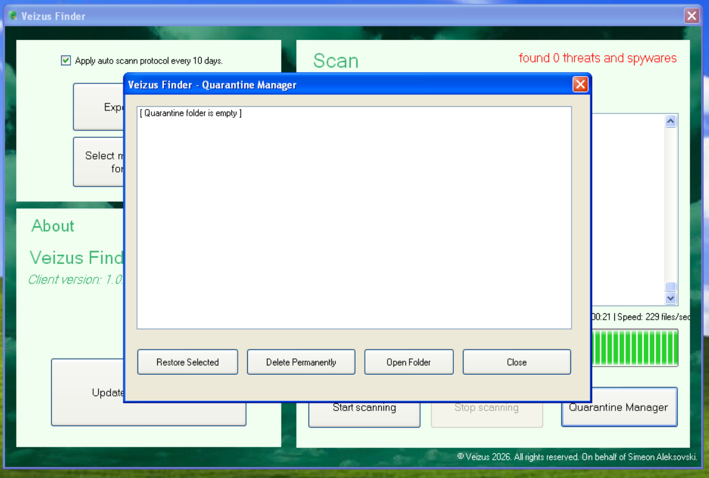

# Veizus Finder

Meet Veizus Finder. A next-generation security engine engineered natively for classic architecture. From Windows XP to 11, it delivers real-time protection, zero-bloat file scanning, and a custom signature database—giving you modern peace of mind without compromising system performance.

## What it is

Veizus Finder is a standalone security suite that checks files against a custom `.vdb` signature engine. It actively monitors your system in the background, isolates suspicious files into an encrypted quarantine manager, and handles modern threat detection without bogging down older hardware. 

## Core Features

- **Real-Time Active Protection:** Runs silently in the background, instantly intercepting and scanning new or modified files on your primary drive.
- **Modular Signature Engine (VDB):** Advanced threat detection supporting MD5 hash matching, text strings (with wide/nocase support), and hex byte wildcard sequences.
- **Media Detection:** Instantly detects when USB drives or CD/DVDs are inserted and prompts for a secure scan.
- **Scan Scheduling:** Automatically initiates a full system sweep every 10 days to catch dormant threats.
- **Context Menu Integration:** Right-click any folder or file in Windows Explorer to instantly scan it with Veizus Finder.
- **System Tray & Auto-Start:** Boots with Windows automatically and minimizes to the system tray for zero-distraction security.
- **Exclusion Manager:** Whitelist specific files or development directories to prevent false positives and optimize scan speeds.
- **Quarantine Manager:** Safely encrypts and isolates threats (`.vir` format), allowing you to restore or permanently delete them safely.

## Requirements

- Windows XP SP3 or later (32-bit and 64-bit natively supported)
- .NET Framework 4.0 (Redistributable included in the release ISO)

## Download & Installation

Grab the latest release from the [Releases](../../releases) page. The `.iso` contains the setup launcher, the latest signature database, and the required .NET installer.

1. Mount or burn the `.iso`
2. Run `Setup.exe` (Install .NET Framework 4.0 if prompted)
3. Launch Veizus Finder, then apply the bundled `signatures.vdb`; it loads into memory automatically.

## Screenshots

## License & Usage

Veizus Finder is free to download and use. The source code is closed, and redistribution of modified copies is not permitted.

**Author**
© Veizus 2026. All rights reserved. On behalf of Simeon Aleksovski.
